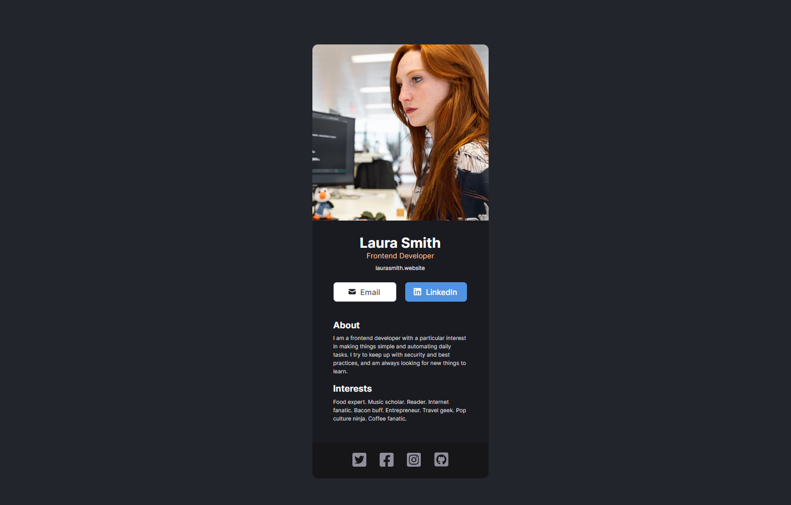

# Solo Project

Exercício do curso de react : [Scrimba - Learn React](https://scrimba.com/learn/learnreact).

## Screenshots

## Links

Link: https://scrimba-first-react-page.vercel.app/

## Aprendizados

Separar e estilizar componentes.

## Construído com

-   React

## Autores

-   [@Mveryy](https://github.com/Mveryy)
